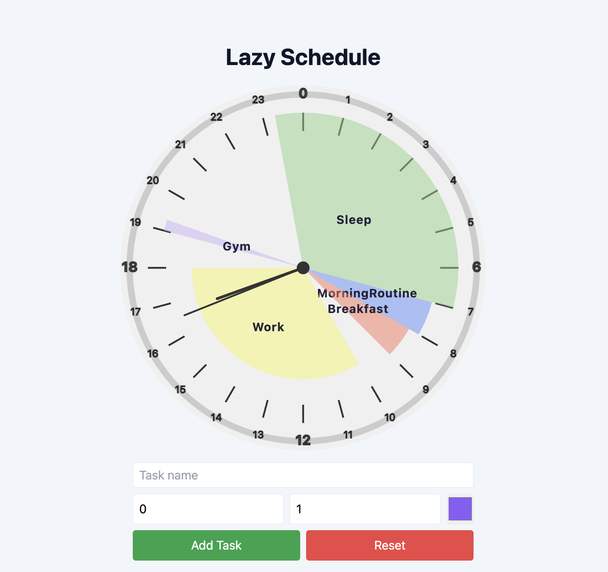

# Lazy Schedule App

A simple, visual 24-hour clock scheduler built with React and TypeScript. Add tasks and see your day at a glance!

## Features

**24-hour clock face** with hour and minute hands
**Add tasks** with:
  - Name
  - Start and end time (supports decimals for minutes, e.g. 7.5 = 7:30)
  - Custom color picker for each task
**Color-coded arcs** for each task, drawn as pie slices
**Labels** always centered in their arc, even if the task crosses midnight
  - **Dynamic background** (day/evening/night)
  - **Responsive design** for desktop and mobile
  - **Reset** button to clear all tasks

  ## Getting Started

1. **Install dependencies:**
   ```bash
   npm install
   # or
   yarn install
   ```

2. **Start the development server:**
   ```bash
   npm run dev
   # or
   yarn dev
   ```

3. **Open your browser:**  
   Visit [http://localhost:5173](http://localhost:5173) (or the port shown in your terminal).

## Usage

- Enter a task name, start hour, end hour, and pick a color.
- Click **Add Task** to add it to the clock.
- Click **Reset** to clear all tasks.
- Tasks that cross midnight (e.g. 22 → 6) are supported.

## Tech Stack

- [React](https://react.dev/)
- [TypeScript](https://www.typescriptlang.org/)
- [Tailwind CSS](https://tailwindcss.com/)
- [Vite](https://vitejs.dev/)

## Screenshots




Made with ❤️ by [Veefa]